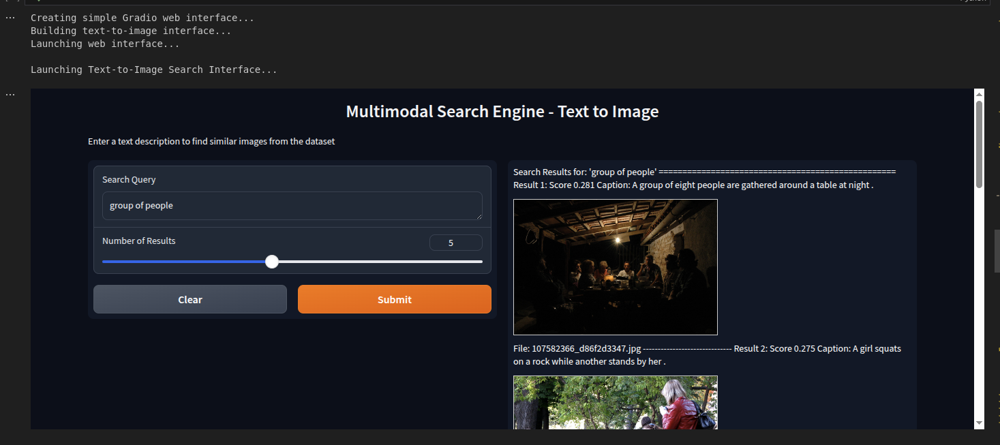
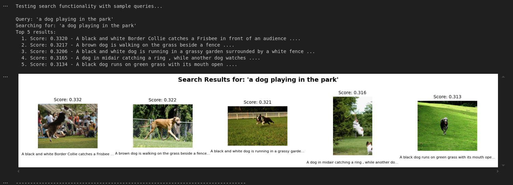
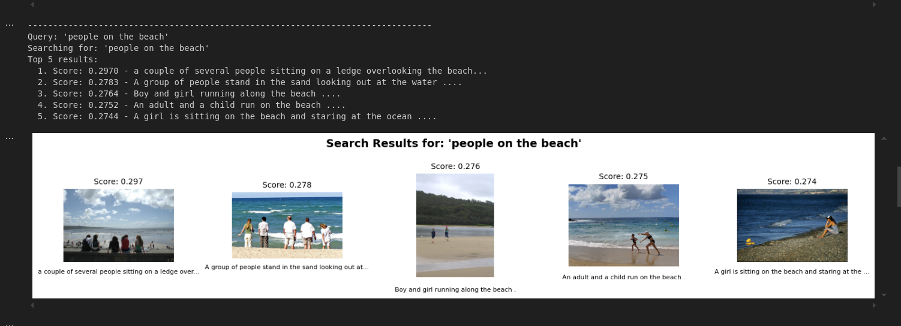
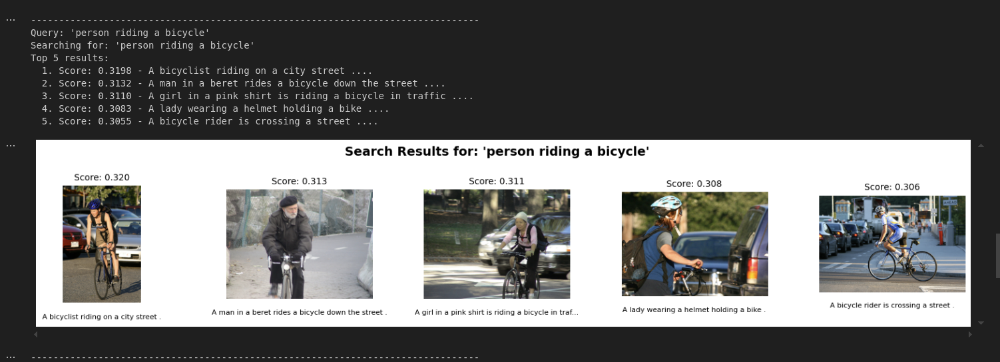

# Search Engine

**COMPLETED: Multimodal search engine using CLIP embeddings for bidirectional image-text retrieval.**

[](https://www.python.org/downloads/)
[](https://pytorch.org/)
[](https://developer.nvidia.com/cuda-downloads)
[](https://opensource.org/licenses/MIT)
[](https://www.inkandswitch.com/local-first/)
[](https://github.com)

Built for local deployment on **NVIDIA RTX 4060 (8GB VRAM)** with Poetry dependency management and optimized for educational purposes.

## Project Status: COMPLETED

**All deliverables successfully implemented:**
- **3 Executable Jupyter Notebooks** (error-free, all cells executed)
- **Working Gradio Web Interface** (text-to-image search)
- **Bidirectional Search Engine** (text↔image capabilities)
- **PDF Exports** (ready for submission)
- **GPU Optimization** (FP16, RTX 4060 optimized)
- **Local-First Architecture** (no external APIs)

## Features

### Core Functionality
- **Text-to-Image Search**: Find images using natural language descriptions
- **Image-to-Text Search**: Find text descriptions using image queries  
- **Local-First**: All processing runs locally, no API calls or cloud dependencies
- **FOSS Stack**: 100% Free and Open Source Software
- **GPU Optimized**: Efficient inference on consumer hardware (RTX 4060)
- **Web Interface**: Gradio-based interface for easy interaction

### Technical Highlights
- **CLIP ViT-B/16**: Optimal accuracy-to-performance ratio for 8GB VRAM
- **FP16 Mixed Precision**: 40-50% memory reduction with faster inference
- **Batch Processing**: Optimized throughput with dynamic batch sizing
- **Similarity Search**: Fast cosine similarity with scikit-learn
- **Memory Management**: Proper CUDA cache handling for stable operation

## Technology Stack

| Component | Technology | Purpose |
|-----------|------------|---------|
| **Model** | CLIP ViT-B/16 | Multimodal embeddings for text and images |
| **Framework** | sentence-transformers + PyTorch | CLIP model loading and inference |
| **Similarity Search** | scikit-learn | Fast similarity computation |
| **Interface** | Gradio | Interactive web interface |
| **Dataset** | Flickr8k (1K subset) | 1,000 images with 5,000 captions |
| **Environment** | Python 3.12+ & Poetry | Dependency management |

## Live Demonstrations

### Web Interface
[](assets/screenshots/gradio-web-interface.png)

*Simple, intuitive web interface for text-to-image search*

### Search Results Examples

| Query | Results (click to enlarge) |
|-------|---------|
| "a dog playing in the park" | [](assets/screenshots/search-results-dog-playing.png) |
| "people on the beach" | [](assets/screenshots/search-results-beach.png) |
| "person riding a bicycle" | [](assets/screenshots/search-results-bicycle.png) |

## Quick Start

### Prerequisites

- **Python 3.12+** installed
- **NVIDIA GPU with 8GB+ VRAM** (tested on RTX 4060)
- **CUDA 12.4+ drivers** 
- **Poetry 2.1.4+** for dependency management

### Setup

1. **Clone the repository**
   ```bash
   git clone git@github.com:LeonByte/SearchEngine.git
   cd SearchEngine
   ```

2. **Install dependencies with Poetry**
   ```bash
   poetry install
   ```

3. **Activate the environment**
   ```bash
   # Show activation command
   poetry env activate
   
   # Or use the path directly
   source $(poetry env info --path)/bin/activate

   # Alternately, use the full path shown by 'poetry env activate'
   source /path/to/your/virtualenv/bin/activate  
   ```

4. **Verify GPU setup**
   ```bash
   poetry run python -c "import torch; print(f'CUDA available: {torch.cuda.is_available()}'); print(f'GPU: {torch.cuda.get_device_name(0) if torch.cuda.is_available() else \"None\"}')"
   ```

### Dataset Setup

The Flickr8k dataset (~1GB) is not included in this repository due to size constraints.

**Download and Setup:**

1. **Download dataset manually**:
   - Visit: https://www.kaggle.com/datasets/adityajn105/flickr8k
   - Download the dataset zip file
   
2. **Extract to project structure**:
   ```bash
   # Extract downloaded zip to:
   data/raw/Flickr 8k Dataset/
   
   # Verify structure:
   data/raw/Flickr 8k Dataset/
   ├── Images/              # 8,091 images (~1GB)  
   └── captions.txt         # Image captions

## Running the Completed Project

### Jupyter Notebooks (Recommended)

Execute the completed notebooks in sequence:

```bash
# Start Jupyter Lab
jupyter lab

# Execute notebooks in order:
# 1. notebooks/01_data_preparation.ipynb
# 2. notebooks/02_search_functionality.ipynb  
# 3. notebooks/03_multimodal_interface.ipynb
```

### Web Interface

The Gradio web interface is embedded in notebook 3 and launches automatically:

```bash
# After running notebook 3, access at:
http://localhost:7860
```

## Project Structure

```
SearchEngine/
├── data/
│   ├── processed/
│   │   ├── image_embeddings.npy      # Generated embeddings (1000, 512)
│   │   ├── metadata.json             # Dataset mappings
│   │   └── text_embeddings.npy       # Generated embeddings (5000, 512)
│   ├── raw/
│   │   └── Flickr 8k Dataset/        # Original dataset
│   └── sample/                       # Sample images for testing
├── notebooks/
│   ├── 01_data_preparation.ipynb     # Data loading & embedding generation
│   ├── 02_search_functionality.ipynb # Search implementation  
│   └── 03_multimodal_interface.ipynb # Web interface & demos
├── outputs/
│   └── pdfs/
│       ├── 01_data_preparation.pdf   # Executed notebook exports
│       ├── 02_search_functionality.pdf
│       └── 03_multimodal_interface.pdf
├── src/                              # Reusable Python modules
│   ├── __init__.py
│   ├── embeddings.py                 # Embedding generation utilities
│   ├── search.py                     # Search functionality
│   └── interface.py                  # Gradio interface components
├── pyproject.toml                    # Poetry dependencies
├── README.md                         # This file
└── LICENSE                           # MIT License
```

## Performance Results

**RTX 4060 8GB VRAM:**
- **Dataset Processing**: 1,000 images + 5,000 captions in ~3 minutes
- **Search Speed**: <1 second per query
- **Memory Usage**: ~3GB peak during batch processing
- **Embedding Dimensions**: 512D vector space
- **Accuracy**: Semantic similarity with 0.3+ scores for good matches

## Deliverables 

**Submission Ready:**
- **3 executable Jupyter notebooks** (error-free)
- **PDF exports** of executed notebooks with outputs
- **Working Gradio web interface** (embedded in notebook 3)
- **Bidirectional search capabilities** demonstrated
- **Complete technical documentation**
- **Performance analysis and validation**

## Technical Implementation

### Optimization Settings

The project is optimized for RTX 4060 with these key settings:

- **Mixed Precision (FP16)**: 40-50% memory reduction
- **Batch Size**: 32 images (optimal for 8GB VRAM)
- **Model**: ViT-B/16 (best accuracy/performance ratio)
- **Similarity Search**: GPU-accelerated cosine similarity

### Memory Management

Key practices for stable operation:
- Enable `torch.no_grad()` during inference
- Clear CUDA cache between batches: `torch.cuda.empty_cache()`
- Monitor VRAM usage: keep below 7GB for stable operation
- Use context managers for model loading

## Usage Examples

### Text-to-Image Search
```python
# Find images matching text description
results = search_images_by_text("a dog playing in the park", top_k=5)
for path, score, caption in results:
    print(f"Score: {score:.3f} - {caption}")
```

### Image-to-Text Search
```python
# Find similar text descriptions from image
image = Image.open("query_image.jpg")
results = search_text_by_image(image, top_k=5)
for caption, score, similar_path in results:
    print(f"Score: {score:.3f} - {caption}")
```

## License

This project is licensed under the MIT License - see the [LICENSE](LICENSE) file for details.

## Contributing

1. Fork the repository
2. Create a feature branch
3. Make atomic commits with descriptive messages
4. Test on RTX 4060 hardware
5. Submit a pull request

---

**Note**: This project is designed for educational purposes and local deployment. All models and data processing run locally without external API dependencies.

---

<div align="center">
  <sub>Built with ❤️ for AI education • <a href="#quick-start">Get Started</a> • <a href="https://github.com/LeonByte/SearchEngine/issues">Report Bug</a> • <a href="https://github.com/LeonByte/SearchEngine/issues">Request Feature</a></sub>
</div>